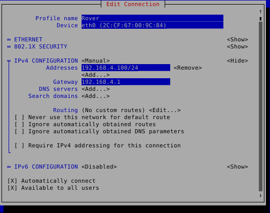

# RPi-Camera

Script to stream USB cameras from Raspberry PI 5 to Basestation with RoveComm control.

## Setup

1. Download and install Raspberry Pi OS Lite (64 bit).

   - <https://www.raspberrypi.com/software/operating-systems/>

2. Configure the system:

   - `$ sudo raspi-config`
   - Select "System Options > Boot / Auto Login > Console Autologin".
   - Select "System Options > Wireless LAN" and connect to a network.

3. Install software:

   - `$ sudo apt update`
   - `$ sudo apt upgrade`
   - `$ sudo apt install ffmpeg v4l-utils vsftpd fswebcam python3 python3-pip`
   - `$ python3 -m pip install --user --break-system-packages pyzmq`

4. Clone the repository to the home directory (/home/pi)
   - Clone recursively to get rovecomm as a submodule. `$ git clone --recurse-submodules https://github.com/MissouriMRDT/RPi-Camera.git`.
   - If the repository is already cloned, make sure to initialize submodules. `$ git submodule update --init --recursive`.

5. Configure `server.py`:

   - Read all comments in `config.toml`.
   - If cloning the repo on another computer:
      - Run `./rpicameradeploy 192.168.4.100 1` and `./rpicameradeploy 192.168.4.101 2` from another computer to `scp` (copy over ssh) the program files to each camera Pi. This command copies the entire program and the correct `config.toml`.
   - If cloning this repository on the Pi:
      - Make `server.py` executable with `$ chmod +x server.py`.
      - `server.py` reads its configuration from `config.toml` which it expects to find in the same directory as `server.py`. Copy `config1.toml` or `config2.toml` to `config.toml`.
      - Update `device[].port` and `name` in `config.toml`.

6. `server.py` should be started on boot, after network has been established. Setup a systemd service:

   - Copy the contents of cameras.service into the text editor.
   - `$ sudo cp ./cameras.service /etc/systemd/system/cameras.service`
   - Enable the service.
   - `$ sudo systemctl enable cameras.service`

7. Set a static IP using either method:
   - `nmtui`
   - In `sudo nmtui`, disable `wlan0` interface and configure and set a static IP for `eth0` that matches the RoveComm manifest.


   
   - `/etc/network/interfaces`
      - `$ sudo cp ./interfaces /etc/network/interfaces`
      - Ensure the address section of the eth0 interfaces is configured to point to the IP address of basestation (see "Port Info") by editing with `$ sudo nano /etc/network/interfaces`.
      - Save and close.

   - Disable wifi. Run `$ sudo nano /boot/firmware/config.txt` and add the line `dtoverlay=disable-wifi` to the very bottom of the file.
      - Save the file with Ctrl+S, then Ctrl+X to exit nano.
      - Restart to make the changes take effect. `$ sudo reboot`

8. Check operation:

   - Start with `sudo systemctl start cameras`.
   - Monitor status with `sudo systemctl status cameras`.
   - Follow logs with `sudo journalctl -fu cameras`.
   - Monitor FFmpeg subprocess and resource utilization `htop`.

## Port Info

The Basestation IP (`config.toml` `ip`) should be `192.168.100.10`.

The Raspberry Pi IP/port combos should be:

```lang-none
192.168.4.100 8100
192.168.4.100 8200
192.168.4.100 8300
192.168.4.100 8400
192.168.4.101 8500
192.168.4.101 8600
192.168.4.101 8700
192.168.4.101 8800
```
